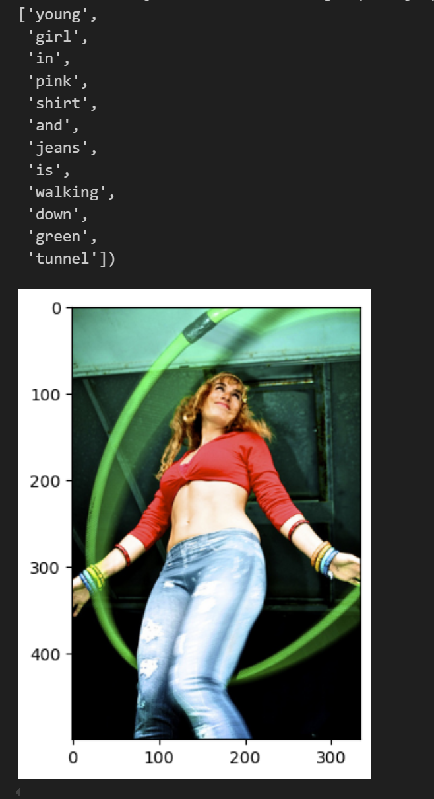

# 🧠 AI Image Captioning using Flickr30k

This project implements an AI-based image captioning system using deep learning. It utilizes the Flickr30k dataset and a hybrid architecture combining a Convolutional Neural Network (CNN) and a Transformer or LSTM decoder to generate descriptive captions for images.

---

## 📌 Features

- CNN (e.g., ResNet-50 or InceptionV3) as an image feature extractor
- Transformer or LSTM decoder for sequence generation
- Beam search decoding for improved caption quality
- Evaluation using BLEU, METEOR, and CIDEr metrics
- Modular and extensible codebase
- Clean, readable output with caption visualization

---

## 🧰 Technologies Used

- Python 3.x
- PyTorch / TensorFlow (based on implementation)
- TorchVision or Keras
- NumPy, Pillow, Matplotlib
- NLTK for text processing
- Flickr30k Dataset (with captions)

---

## 🏁 How to Run

### 1. Clone this Repository

```bash
git clone https://github.com/your-username/image-captioning-flickr30k.git
cd image-captioning-flickr30k
```

### 2. Create a virtual environment (Optional)

```bash
python -m venv venv
source venv/bin/activate #For Windows: venv\Scripts\activate
```

### 3. Install Dependencies

```bash
pip install -r requirements.txt
```

### 4. Download and Organize Data

Download the [Flickr30k](https://www.kaggle.com/datasets/hsankesara/flickr-image-dataset) dataset used for this project. Unzip the folder and place it in the Code directory of this project and you should be ready to go.

### 5. Perform Hyperparameter Training(Optional Step)

Run the file named ResNet-Transformer-Tune.ipynb for checking the model performance on different hyperparameters for a smaller portion of dataset. The code can be modified for changing the parameters observed or increasing the dataset(I utilized a smaller portion of the dataset due to limited GPU power). This code will save model with each combination of hyperparameters and may take up a lot of space. It also keeps track of the best hyperparameters.

### 6. Training the Model

Run the file named ResNet-Transformer.ipynb to train the model on the larger dataset (80% of the entire set). This code will save the trained model by the name of BestModel.

### 7. Generate the Captions

Utilize the model saved in last step to get the evaluation of model performance or to start generating the captions.

---

## 🧪 Output

Here is a sample output caption generated by the model for the image below:


---

## 📜 License
This project is open-source and available under the terms of the [MIT License](LICENSE).

---

## 🌟 Authors
Shail Patel
[GitHub](https://github.com/sapatel11) | [LinkedIn](https://linkedin.com/in/shail-p11)

Vrushali Ranadive
[Github](https://github.com/Vrushali31) | [LinkedIn](https://www.linkedin.com/in/vrushali-ranadive-79437a20a/)

Yash Chaudhary
[GitHub](https://github.com/YashChaudhary16) | [LinkedIn](https://www.linkedin.com/in/yashchaudhary16/)

Devanshu Shah
[Github](https://github.com/devanshu-777) | [LinkedIn](https://www.linkedin.com/in/devanshu-shah777/)
